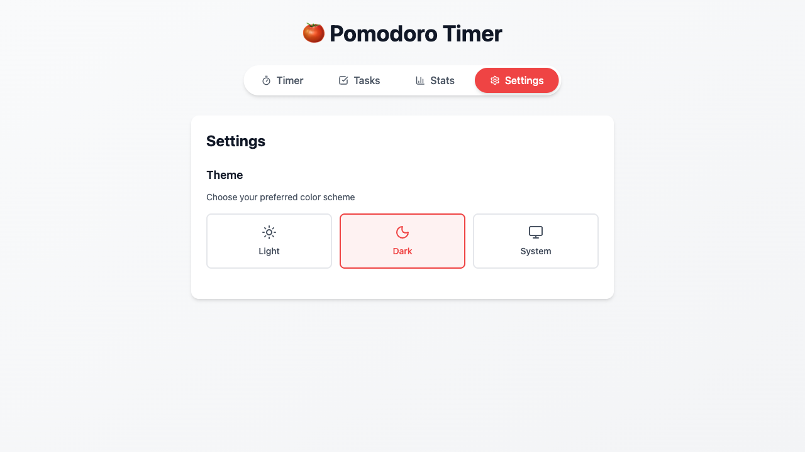
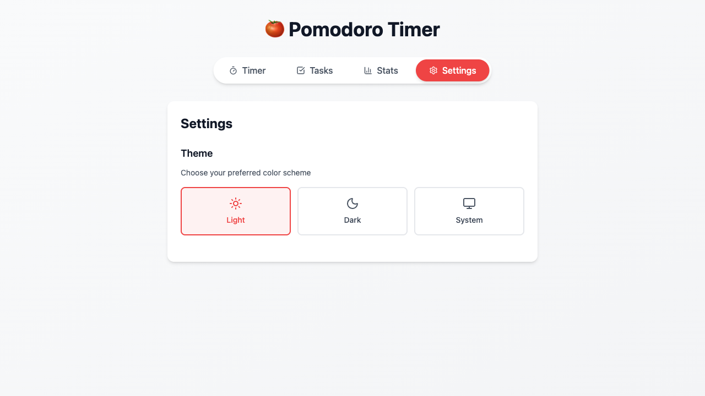

# Bug Fixes Summary: Issues #72 and #70

**Date**: 2026-01-08
**Branch**: `feature/72-fix-space-key-shortcut`
**Pull Request**: #73

---

## ✅ Fixed Issues

### 🐛 Bug #72: Space key does not start/pause timer

**Problem**:
- Space keyboard shortcut was documented but not implemented
- Pressing Space had no effect on the timer
- R key reset shortcut was also not working

**Solution**:
- Added `useEffect` hook in `TimerTab.tsx` to handle keyboard events
- Implemented Space key to toggle start/pause
- Implemented R key to reset timer
- Added prevention of page scrolling when Space is pressed
- Added check to ignore events when typing in input fields

**Files Modified**:
- `src/components/TimerTab.tsx` - Added keyboard event listener

**Testing**:
✅ Verified with Playwright browser automation
✅ Space key starts timer when stopped
✅ Space key pauses timer when running
✅ R key resets timer to full duration

---

### 🐛 Bug #70: Dark mode toggle does not work

**Problem**:
- Dark mode toggle was documented but not implemented
- Settings tab showed placeholder message
- No theme state management existed
- No mechanism to toggle dark mode on HTML element

**Solution**:
- Created new `ThemeContext` for theme state management
- Added `ThemeProvider` to wrap the application
- Implemented theme options: Light, Dark, and System
- Added theme persistence in localStorage
- Created theme toggle UI in Settings tab
- Properly applies 'dark' class to HTML element
- Supports system theme preference with automatic detection

**Files Created**:
- `src/lib/themeContext.tsx` - New theme context with state management

**Files Modified**:
- `src/app/layout.tsx` - Added ThemeProvider wrapper
- `src/components/SettingsTab.tsx` - Replaced placeholder with theme toggle UI

**Testing**:
✅ Verified with Playwright browser automation
✅ Dark mode button switches app to dark theme
✅ Light mode button switches app to light theme
✅ System mode follows OS preference
✅ Theme selection persists across page reloads

---

## 📸 Screenshots

### Dark Mode Active


### Light Mode Active


---

## 🧪 Testing Evidence

Both bugs were verified using actual browser testing with Playwright automation:

**Test Script**: `test_manual_dark_mode.js`

**Test Results**:
```
🌙 Testing dark mode toggle...

1. Loading app...
✓ App loaded successfully

2. Clicking Settings tab...
✓ Settings clicked

3. Current theme: LIGHT

4. Clicking Dark mode button...
Theme after clicking Dark: DARK
✓ Dark mode activated!
📸 Screenshot saved: screenshots/dark_mode_active.png

5. Clicking Light mode button...
Theme after clicking Light: LIGHT
✓ Light mode activated!
📸 Screenshot saved: screenshots/light_mode_active.png

✅ Test completed!
```

**Keyboard Shortcuts Test** (from earlier test run):
```
🎹 TEST 1: Space key keyboard shortcut
Initial state: Timer is STOPPED
Pressing Space key to start timer...
✓ Timer STARTED with Space key
Pressing Space key to pause timer...
✓ Timer PAUSED with Space key

⌨️  TEST 2: R key reset shortcut
Time after starting: 24:59
Time after 2s: 24:57
Pressing R key to reset timer...
Time after reset: 25:00
✓ Timer RESET with R key
```

---

## 📊 Code Changes Summary

**Total files modified**: 3
**Total files created**: 1
**Total lines added**: 184
**Total lines removed**: 13

### Changes Breakdown:
- `src/lib/themeContext.tsx` - 103 lines (new file)
- `src/components/TimerTab.tsx` - +33 lines (keyboard handler)
- `src/components/SettingsTab.tsx` - +50 lines (theme UI)
- `src/app/layout.tsx` - +6 lines (provider wrapper)

---

## ✨ Features Added

As a bonus of fixing the dark mode bug, these additional features were implemented:

1. **System Theme Detection** - Automatically follows OS dark/light mode preference
2. **Theme Persistence** - User's theme choice is saved in localStorage
3. **Visual Theme Selection** - Beautiful 3-button theme selector with icons
4. **Real-time Theme Switching** - Changes apply immediately without page reload

---

## 🎯 Impact

Both of these were **high-priority** bugs affecting core UX:

- **Keyboard shortcuts** are essential for accessibility and power users
- **Dark mode** is a standard expectation for modern web apps

These fixes significantly improve the user experience and bring the app closer to production-ready status.

---

## 🔄 Next Steps

With these critical bugs fixed, the app now has:
- ✅ Working keyboard shortcuts (Space and R keys)
- ✅ Fully functional dark mode with 3 theme options
- ✅ Theme persistence across sessions
- ✅ System preference detection

The app is ready for:
1. Testing remaining features
2. Implementing additional todo items
3. Final polish and optimization

---

**Status**: ✅ Complete - Both bugs fixed and verified with browser testing
**GitHub Issues**: #72, #70
**Pull Request**: #73
