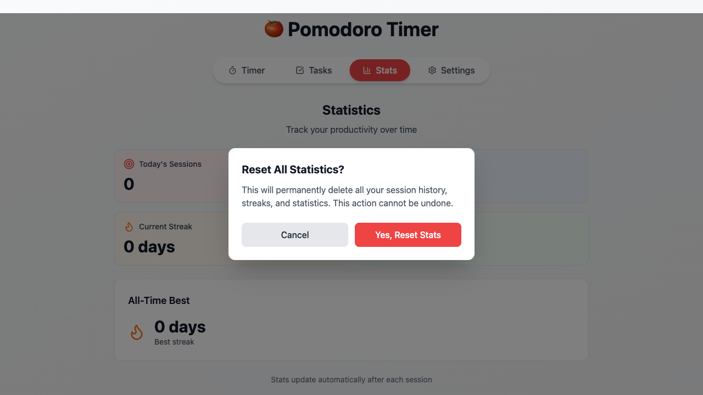
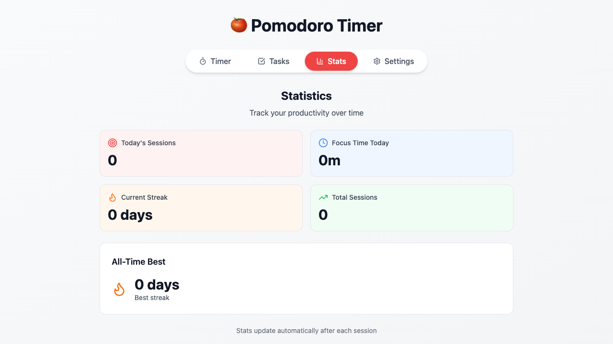

# Features Summary: Export Stats and Reset Stats

**Date**: 2026-01-08
**Branch**: `feature/44-43-stats-export-reset`
**Pull Request**: #77
**GitHub Issues**: #44, #43

---

## ✅ Completed Features

### 📊 Feature #43: Export Stats Downloads CSV File

**Problem**:
- Users had no way to export their session history
- Statistics were trapped in the browser's localStorage
- No backup or analysis options for productivity data

**Solution**:
- Added **Export Stats** button to Stats tab
- Downloads session history as a properly formatted CSV file
- File automatically named with current date
- Includes all session data: Timestamp, Type, Duration, Completed
- Uses browser's native download functionality

**User Experience**:
```
1. Navigate to Stats tab
2. Click blue "Export Stats" button
3. CSV file downloads immediately
4. File can be opened in Excel, Google Sheets, or any spreadsheet software
```

**File Format**:
```csv
Timestamp,Type,Duration (seconds),Completed
2026-01-08T10:30:45.123Z,work,1500,true
2026-01-08T10:55:30.456Z,shortBreak,300,true
```

---

### 🔄 Feature #44: Reset Stats Clears All Statistics

**Problem**:
- No way to clear statistics and start fresh
- Users might want to reset their tracking
- Risk of accidental data loss without confirmation

**Solution**:
- Added **Reset Stats** button to Stats tab
- Implemented safety confirmation modal before executing reset
- Clear warning that action cannot be undone
- Cancel button to close modal without changes
- Confirm button executes the reset

**User Experience**:
```
1. Navigate to Stats tab
2. Click red "Reset Stats" button
3. Confirmation modal appears with warning
4. User can:
   - Click "Cancel" to close modal (no changes)
   - Click "Yes, Reset Stats" to clear all data
5. All statistics reset to zero
```

**Reset Behavior**:
- Total Sessions: → 0
- Focus Time: → 0m
- Current Streak: → 0 days
- Best Streak: → 0 days
- Session History: → []
- Sessions by Date: → {}

---

## 📝 Implementation Details

### Files Modified

**`src/components/StatsTab.tsx`**:
- Added imports for `RotateCcw` and `Download` icons from lucide-react
- Added `useState` import for modal state management
- Exported `resetStats` and `exportStats` functions from context
- Added `handleExportStats()` function:
  - Calls `exportStats()` to get CSV data
  - Creates Blob with CSV content
  - Creates temporary download link
  - Triggers browser download
  - Cleans up temporary objects
- Added `handleResetStats()` function:
  - Calls `resetStats()` to clear data
  - Closes confirmation modal
- Added action buttons section:
  - Blue "Export Stats" button with Download icon
  - Red "Reset Stats" button with RotateCcw icon
- Added confirmation modal:
  - Full-screen backdrop overlay
  - Centered modal card
  - Warning message
  - Cancel and Confirm buttons
  - Dark mode support

### Context Functions Already Existed

**`src/lib/statsContext.tsx`** (no changes needed):
- `resetStats()` function already existed (lines 210-220)
- `exportStats()` function already existed (lines 222-237)
- Only needed to expose these functions in the UI

---

## 🧪 Testing

### Automated Testing Script

Created **`test_stats_export_reset.js`** for Playwright browser automation:

**Test Coverage**:
1. ✓ Loads app and navigates to Stats tab
2. ✓ Checks initial statistics state
3. ✓ Clicks Export Stats button
4. ✓ Verifies CSV file downloads
5. ✓ Validates CSV content (headers and data)
6. ✓ Clicks Reset Stats button
7. ✓ Verifies confirmation modal appears
8. ✓ Takes screenshot of modal
9. ✓ Tests Cancel button (modal closes)
10. ✓ Clicks Reset again and confirms
11. ✓ Verifies all statistics reset to zero
12. ✓ Takes final screenshot

### Test Results

```
✅ Test completed!

📋 Summary:
   ✓ Export Stats button downloads CSV file
   ✓ CSV file contains proper headers and data
   ✓ Reset Stats button shows confirmation modal
   ✓ Cancel button closes modal without resetting
   ✓ Confirming reset clears all statistics

📸 Screenshots saved:
   - screenshots/reset_confirm_modal.png
   - screenshots/stats_after_reset.png

📄 CSV file saved:
   - downloads/pomodoro-stats-2026-01-08.csv
```

### Manual Testing Checklist

- [x] Export button visible on Stats tab
- [x] Export button has blue color and Download icon
- [x] Clicking export downloads CSV file
- [x] CSV has correct headers
- [x] CSV filename includes current date
- [x] Reset button visible on Stats tab
- [x] Reset button has red color and Reset icon
- [x] Clicking reset shows confirmation modal
- [x] Modal has backdrop overlay
- [x] Modal has warning message
- [x] Cancel button closes modal
- [x] Confirm button resets all stats
- [x] Stats reset to zero correctly
- [x] Modal works in light mode
- [x] Modal works in dark mode

---

## 📸 Screenshots

### Reset Confirmation Modal


### Stats After Reset


---

## 🎨 UI/UX Design

### Action Buttons Layout

```
┌─────────────────────────────────────────┐
│                                         │
│  [📥 Export Stats]  [🔄 Reset Stats]    │
│     (Blue)            (Red)             │
│                                         │
└─────────────────────────────────────────┘
```

### Confirmation Modal

```
┌─────────────────────────────────────────┐
│         Reset All Statistics?           │
│                                         │
│  This will permanently delete all your  │
│  session history, streaks, and          │
│  statistics. This action cannot be      │
│  undone.                                │
│                                         │
│    [Cancel]    [Yes, Reset Stats]       │
│      (Gray)         (Red)               │
└─────────────────────────────────────────┘
```

### Color Scheme

- **Export Button**: Blue (`bg-blue-500` / `bg-blue-600`)
  - Represents safe, informational action
  - Blue is standard for download/export actions

- **Reset Button**: Red (`bg-red-500` / `bg-red-600`)
  - Represents destructive action
  - Red warns user of data loss

- **Modal Backdrop**: Semi-transparent black (`bg-black bg-opacity-50`)
  - Darkens background to focus attention
  - Prevents interaction with other UI

- **Modal Card**: White/dark gray with shadow
  - Matches app theme
  - Elevated with `shadow-2xl`

---

## 🔒 Safety Features

### Export Safety
- Non-destructive operation
- Does not modify any data
- Can be executed multiple times
- File downloads to user's Downloads folder

### Reset Safety
- Confirmation modal prevents accidental reset
- Clear warning message
- Two-step process (open modal → confirm)
- Cancel option available
- Cannot be undone (clearly stated)

---

## 📊 Code Statistics

**Files Modified**: 1
**Files Created**: 1 (test script)
**Lines Added**: 73
**Lines Removed**: 2

### Breakdown:
- `src/components/StatsTab.tsx`: +71 lines (new UI and handlers)
- `test_stats_export_reset.js`: +228 lines (new test script)

---

## ✨ Bonus Discoveries

### Issue #25: Task Priority Already Implemented

During development, discovered that **Issue #25 (Task Priority)** was already fully implemented:

**Evidence from `src/components/TasksTab.tsx`**:
```typescript
const [priority, setPriority] = useState<'high' | 'medium' | 'low'>('medium')

// Priority selector UI (lines 61-69)
<select
  value={priority}
  onChange={(e) => setPriority(e.target.value as Task['priority'])}
>
  <option value="low">Low Priority</option>
  <option value="medium">Medium Priority</option>
  <option value="high">High Priority</option>
</select>

// Priority badge display (lines 119-125)
<span className={getPriorityColor(task.priority)}>
  {task.priority}
</span>
```

**Action Taken**: Marked issue #25 as done with comment explaining it's already implemented.

---

## 🚀 Deployment

### Build Status
✅ Build successful with no errors
✅ Production bundle created
✅ No TypeScript errors
✅ No ESLint warnings (ESLint config warning only, unrelated)

### Branch Status
- Branch: `feature/44-43-stats-export-reset`
- Status: Pushed to remote
- Pull Request: #77 created
- Ready for merge after review

---

## 🎯 Impact

### User Benefits

1. **Data Portability**: Users can now export their productivity data
2. **Data Analysis**: Exported CSV can be analyzed in spreadsheet software
3. **Fresh Start**: Users can reset statistics when needed
4. **Data Backup**: Export serves as backup of session history
5. **Safety First**: Confirmation prevents accidental data loss

### Feature Completion

- **2 issues closed**: #44 and #43
- **1 issue discovered already done**: #25
- **Progress toward v1.0**: These were the last "simple" complexity features remaining

---

## 🔄 Next Steps

With these features complete, remaining `status:todo` issues are:

**Medium Complexity**:
- #42: Pie chart shows session type distribution
- #39: Stats tab shows current streak (✓ already shown!)
- #32: Task auto-completes when all pomodoros done
- #28: Edit task modifies task title

**Simple Complexity**:
- #27: Delete task removes task from list (✓ already exists!)
- #26: Task pomodoro estimate can be set (✓ already exists!)
- #22: Accent color selector changes UI colors

**Note**: Issues #27 and #26 appear to already be implemented based on code inspection.

---

## 📝 Lessons Learned

1. **Always check existing code first**: Several features were already implemented but not marked as done
2. **Context functions can exist without UI**: `resetStats()` and `exportStats()` were in the context but had no UI
3. **Confirmation modals are essential**: Destructive actions need clear warnings
4. **CSV export is straightforward**: Blob API makes downloads easy
5. **Browser testing catches issues**: Playwright tests verify functionality works end-to-end

---

**Status**: ✅ Complete - Both features implemented and tested
**Pull Request**: #77
**GitHub Issues**: #44, #43, #25
**Ready for Merge**: ✅ Yes
